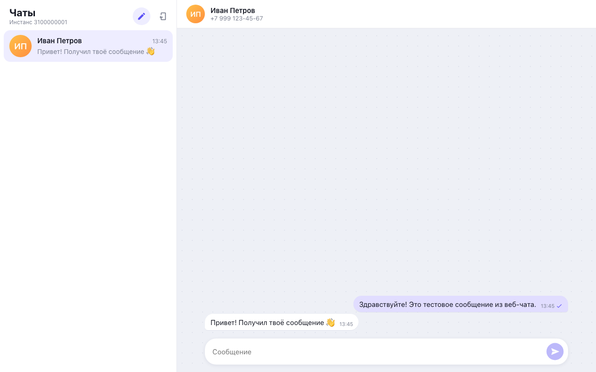
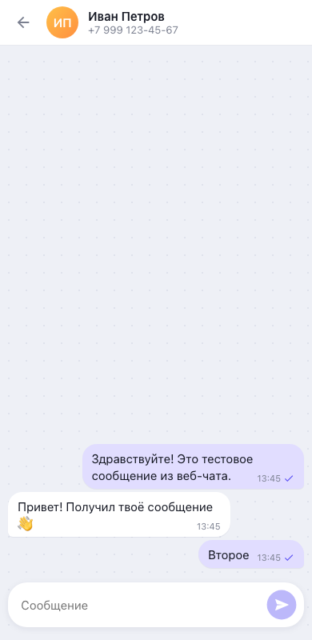

# Telegram Chat · GREEN-API

Веб-интерфейс для отправки и получения текстовых сообщений в **Telegram** через [GREEN-API](https://green-api.com/). Внешний вид — по мотивам [web.max.ru](https://web.max.ru/), как указано в задании.

Тестовое задание на позицию «Фронтенд-разработчик React».

- Сайт: https://akkord1ch.github.io/green-api-test/
- Репозиторий: https://github.com/aKKord1ch/green-api-test

> **Почему Telegram, а не MAX.** Задание допускает WhatsApp или Telegram, если выполнить его для MAX нельзя. В личном кабинете GREEN-API создать инстанс MAX не удалось — доступны только Telegram и WhatsApp. Методы API (`SendMessage`, `ReceiveNotification`, `DeleteNotification`) у них одинаковые, поэтому приложение работает по той же схеме.

<p>
  
  
</p>

## Возможности

- Вход по `idInstance` и `apiTokenInstance` (+ `apiUrl` инстанса) с проверкой состояния инстанса.
- Создание чата по номеру телефона получателя.
- Отправка текстовых сообщений — метод [SendMessage](https://green-api.com/v3/docs/api/sending/SendMessage/).
- Получение ответов — [HTTP API](https://green-api.com/v3/docs/api/receiving/technology-http-api/): `ReceiveNotification` (long-polling) → обработка → `DeleteNotification`.
- Статусы исходящих сообщений (отправляется / отправлено / ошибка), автопрокрутка, Enter — отправить, Shift+Enter — перенос строки.
- Чаты и история сохраняются в `localStorage`; адаптивная вёрстка для телефона.

## Локальный запуск

Требуется Node.js 20+.

```bash
git clone <url-репозитория>
cd green-api-test
npm install
npm run dev
```

Откройте http://localhost:5173.

| Команда           | Что делает                           |
| ----------------- | ------------------------------------ |
| `npm run dev`     | dev-сервер Vite                      |
| `npm run build`   | проверка типов и production-сборка   |
| `npm run preview` | локальный просмотр собранной версии  |
| `npm run lint`    | ESLint (включая правило импортов FSD) |

## Как пользоваться

1. Создайте инстанс Telegram в [личном кабинете GREEN-API](https://console.green-api.com) и авторизуйте его.
2. Скопируйте со страницы инстанса `apiUrl`, `idInstance` и `apiTokenInstance`, введите их на экране входа.
3. Нажмите ✎ «Новый чат» и введите номер получателя (например, `+7 999 123-45-67`).
4. Напишите сообщение — оно придёт получателю в Telegram. Ответ получателя появится в чате через несколько секунд.

> Для получения сообщений через HTTP API в настройках инстанса должен быть **пустой `webhookUrl`** и включены входящие уведомления (`incomingWebhook: yes`). Если это не так, приложение предупредит при входе и предложит исправить настройки одной кнопкой (метод `SetSettings`).

### Сопоставление входящих с чатом

Чат создаётся по номеру телефона и отправляет на `79991234567@c.us`, а во входящем уведомлении `chatId` может быть в другом формате (числовой id собеседника). Поэтому входящие сопоставляются с чатом по `senderData.senderPhoneNumber` либо по `chatId`, после чего чат запоминает `chatId` из уведомления. Сообщения от собеседников, которым ещё не открыт чат, создают новый чат автоматически.

## Стек

- React 19 + TypeScript, Vite
- Zustand (+ `persist`) — состояние сессии, чатов и сообщений
- CSS Modules, без UI-библиотек
- ESLint, GitHub Actions → GitHub Pages

## Архитектура — Feature-Sliced Design

```
src/
├── app/        # точка входа, глобальные стили, выбор страницы по сессии
├── pages/
│   ├── login/  # экран входа
│   └── chat/   # сайдбар + окно чата, запуск получения уведомлений
├── widgets/
│   ├── sidebar/      # список чатов, кнопки «новый чат» и «выйти»
│   └── chat-window/  # шапка, лента сообщений, форма отправки
├── features/
│   ├── auth/              # вход (проверка инстанса и настроек), выход
│   ├── create-chat/       # создание чата по номеру телефона
│   ├── send-message/      # отправка сообщения (SendMessage)
│   └── receive-messages/  # цикл ReceiveNotification → DeleteNotification
├── entities/
│   ├── session/  # учётные данные инстанса
│   ├── chat/     # модель чата, стор, элемент списка
│   └── message/  # модель сообщения, стор, «пузырь» сообщения
└── shared/
    ├── api/      # клиент GREEN-API и типы
    ├── config/   # константы
    ├── lib/      # телефоны, форматирование времени
    └── ui/       # Button, Input, Modal, Avatar, Icon, Spinner
```

Слои импортируют только нижележащие слои, слайсы — только через публичный API (`index.ts`); глубокие импорты запрещены правилом ESLint.

## Деплой

Workflow `.github/workflows/deploy.yml` собирает проект и публикует его в GitHub Pages при пуше в `main`. В настройках репозитория: **Settings → Pages → Source: GitHub Actions**.
